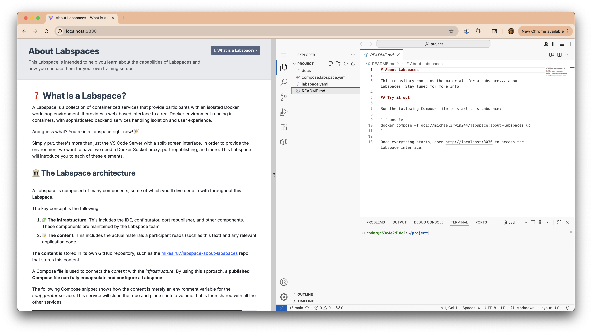
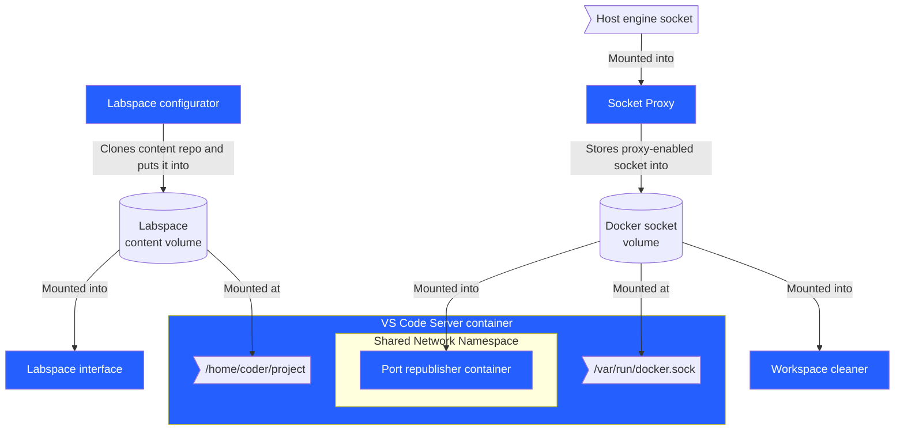

# Labspace Infra

This repository provides the infrastructure and components required to run Labspaces.



## Architecture

A Labspace can be thought of as two types of materials coming together: **infrastructure** and **content**.

### Infrastructure architecture

Several components and services are brought together to provide the infrastructure for a Labspace.



- **Interface** - provides the split-screen interface that renders the Labspace instructions and VS Code
- **VS Code Server** - extends the [coder/code-server](https://github.com/coder/code-server) project to provide VS Code in a browser, pre-configured with tooling to support a Docker-focused lab environment
- **Configurator** - clones the repo and puts it into a volume that is then shared with the VS Code server.
- **[Docker Socket Proxy](https://github.com/mikesir87/docker-socket-proxy)** - wraps the Docker Socket to put various protections/remappings in place. Specifically:
  - Docker commands will only return the items created by this environment (newly created items are mutated with a label and object responses filter on that label)
  - Mounts in new containers are only allowed from within the project
  - Mount source paths are remapped to the volume the files are found in (even if using relative paths)
  - Requests to start a new container with the Docker socket will be remapped to use the proxied socket. This ensures Testcontainers config also uses the remapping, etc.
- **Host Port Republisher** - this container runs in the same network namespace as the VS Code Server and watches for container start/stop events that have published ports. It then starts socat processes to allow the forwarding of localhost ports to the container.
    - Example: start a postgres container in the IDE terminal, publishing the port. With this, you can then connect to it using `psql -h localhost` without using host network mode (which isn't always available)

## Known limitations

- Running multiple instances will cause port conflicts
- Volume names are currently hard-coded in the Compose file (for remapping/allowlisting of mount sources)

## Development

"Development" largely depends on what type of development you are trying to do - work on the Labspace infrastructure or writing Labspace content.

### Labspace infra development

To work on the Labspace infrastructure, you can utilize the `compose.yaml` file. Make sure to enable Compose Watch mode with the `--watch` flag.

```console
docker compose up --watch --build
```

After it starts, open the interface at http://localhost:5173.

### Labspace content development

If you want to make a Labspace, follow these steps:

1. Create a repo or folder that will store your Labspace

2. Create a `labspace.yaml` that defines the Labspace. See the example at `[./sample-content-repo/labspace.yaml](./sample-content-repo/labspace.yaml)`.

3. Start a Labspace in "dev mode". This will mount the content, rather than fetch it, and configure the interface to poll for content changes.

    ```console
    # On Mac
    CONTENT_PATH=$PWD docker compose -f oci://michaelirwin244/labspaces:dev up

    # On Windows with PowerShell
    $Env:CONTENT_PATH = (Get-Location).Path; docker compose -f oci://michaelirwin244/labspaces:dev up
    ```
4. Open http://localhost:3030 to open the interface

5. Write your content as you wish! You should see the changes reflected in the interface shortly after saving any file changes.

