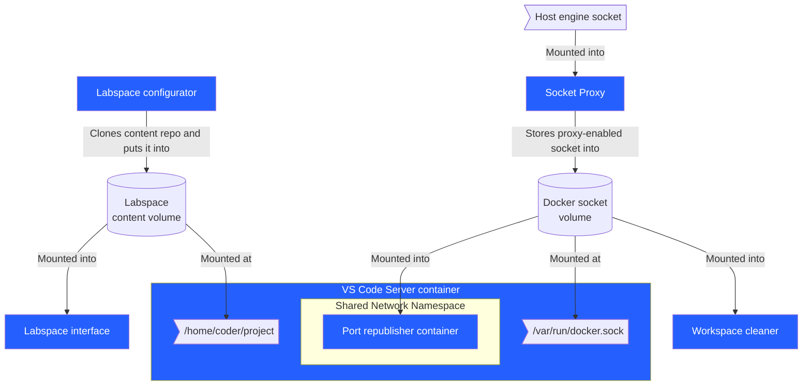

## Architecture

A Labspace can be thought of as two types of materials coming together: **infrastructure** and **content**.

### Infrastructure architecture

Several components and services are brought together to provide the infrastructure for a Labspace.



- **Interface** - provides the split-screen interface that renders the Labspace instructions and VS Code
- **VS Code Server** - extends the [coder/code-server](https://github.com/coder/code-server) project to provide VS Code in a browser, pre-configured with tooling to support a Docker-focused lab environment
- **Configurator** - clones the repo and puts it into a volume that is then shared with the VS Code server.
- **[Docker Socket Proxy](https://github.com/mikesir87/docker-socket-proxy)** - wraps the Docker Socket to put various protections/remappings in place. Specifically:
  - Docker commands will only return the items created by this environment (newly created items are mutated with a label and object responses filter on that label)
  - Mounts in new containers are only allowed from within the project
  - Mount source paths are remapped to the volume the files are found in (even if using relative paths)
  - Requests to start a new container with the Docker socket will be remapped to use the proxied socket. This ensures Testcontainers config also uses the remapping, etc.
- **Host Port Republisher** - this container runs in the same network namespace as the VS Code Server and watches for container start/stop events that have published ports. It then starts socat processes to allow the forwarding of localhost ports to the container.
    - Example: start a postgres container in the IDE terminal, publishing the port. With this, you can then connect to it using `psql -h localhost` without using host network mode (which isn't always available)
- **VS Code extension** - a custom VS Code extension that provides additional support and functionality in the system, including:
  - Support the "Run" button from the interface to send commands to run in the terminal

### Content architecture

The _content_ for a Labspace is sourced from a git repository.

At the root of the repository is a `labspace.yaml` that defines the Labspace. The following is an example:

```yaml
title: Sample Labspace
description: >
  This Labspace is an example and this description would appear in the header under the title.

sections:
# - title: The name/title of the section. This will appear in the dropdowns and used to generate an "id" of the section (for navigation, etc.)
#   contentPath: The path to the Markdown file, relative to the root of the repository
  - title: Section number one
    contentPath: ./path/to/section-one.md
  - title: The second section
    contentPath: ./section-two.md
```

The markdown files support all GitHub-flavored Markdown. Any `bash`, `sh`, or `console` code blocks will automatically be given a "Run" button to easily run the command in the VS Code editor.