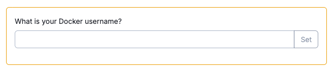

# Markdown options

This document is used to document the various options that exist when writing your Labspace content.

## General markdown support

The interface supports all of the GitHub Flavored Markdown features, as well as the [custom alerts](https://docs.github.com/en/get-started/writing-on-github/getting-started-with-writing-and-formatting-on-github/basic-writing-and-formatting-syntax#alerts).


## Embedding images

Image support exists, but all paths are anchored using the root of the repo, _not the markdown file_.

For example, given the following directory structure:

```
.
└── labspace/
    └── images/
        └── screenshot.png
```

The image will be rendered with either of the following markdown snippets:

    
    


## Code blocks

By default, every code block will be given a "Copy code" button. Additionally, any `bash`, `shell`, or `console` block will also be given a "Run" button.

There is also an ability to add a "Save as" button to enable easy file creation/saving.

### Disabling the copy button

In the cases you don't want the copy button to be made visible, add the `no-copy-button` metadata to the block.

This might be useful when showing sample console output that isn't intended to be something a user copies.

    ```plaintext no-copy-button
    CONTAINER ID   IMAGE                                      COMMAND                  CREATED         STATUS         PORTS                    NAMES
    7eb17e337a13   dockersamples/labspace-interface:v0.6.0    "docker-entrypoint.s…"   6 minutes ago   Up 6 minutes   0.0.0.0:3030->3030/tcp   labspace-infra-interface-1
    ...
    ```

This rendered code block will _not_ have the copy button.


### Disabling the run button

At times, you might want to disable the run button, but still render a code block using the syntax highlighting of a `bash` prompt. You can do so by using the `no-run-button` metadata.

    ```bash no-run-button
    docker ps
    ```

This rendered block will _not_ have the run button.


### Add a "Save file" button

To add a "Save file" button, use the `save-as=path/to/file.txt` metadata.

    ```yaml save-as=compose.yaml
    services:
      app:
        image: nginx
    ```

If a user clicks this "Save file" button, a `compose.yaml` file will be created with the following content.

- If the file already exists, the contents will be replaced with what is provided in the code block.
- All required directories leading up to the file will automatically be created

Note that the path is anchored to the workspace directory. However, special handling is provided for paths that start with `~` in the case a file needs to be saved in the user's home directory.


## Links

By default, all links are configured to open new browser tabs when clicked.

### Opening links as a tab

If you want to add another tab to the right-hand panel, you can use the following directive:

    ::tabLink[Link text]{href="http://localhost:3000" title="Tab title" id="app"}

This will render a link with the visible text of "Link text" pointing to "http://localhost:3000". When clicked, a new tab will be created with the title of "Tab title".

If a tab with the same `id` exists (either through a previous click or it was defined in the `labspace.yaml`), that tab will be activated and the URL will be updated based on the defined `href`.


### Opening files in the IDE

If you want to create a link that will open a project file in the IDE, you can use the following directive:

    Open the :fileLink[compose.yaml]{path="compose.yaml"} file ...

Directive arguments include:

- **path** - the full path _from the root of the project_ of the file to open
- **line** (optional) - the line number (1-based) to put the cursor on

The body (text inside the `[]`) is what will be displayed to the user.

Note that the path is anchored to the workspace directory. However, special handling is provided for paths that start with `~` in the case a file needs to be saved in the user's home directory.


## Custom variables

Labspaces provide the ability to ask the user for a value for a variable, which will be used throughout the documentation. This prevents the need to have instructions such as "Replace USERNAME with your username before running the command." Now, you can simply ask them for it up front and the command will have the value.

There are two options to define variables - use a user-defined value or a pre-defined value.

### User-defined variables

To allow a user to provide the value for a variable, use the `::variableDefinition` directive. The directive requires the variable name and a prompt. Example:

    ::variableDefinition[username]{prompt="What is your Docker username?"}

This will display a card that will ask the user for their Docker username.



The variable values are stored in memory in the interface backend. This ensures the values are interpolated for all file saves and command executions. Note that because they are stored in memory, if the Labspace is restarted, all values will be lost.

### Pre-defined variables

There may be times in which you want to set a value to a pre-defined variable. Use the `::variableSetButton` to do so. Example:

    ::variableSetButton[Set default greeting]{variable="greeting" value="hello"}

After clicking the button, the variable `greeting` will have the value of `hello`.

### Using the variables

Once a variable is defined, it can be used anywhere in the markdown files using the syntax `$$VAR_NAME$$`.

For example, to use the variable defined in the previous example, you can have the following markdown:

    1. Build an image with the `docker build` command, tagging it with your username:

        ```bash
        docker build -t $$username$$/my-first-image .
        ```

    2. Run your new image with the `docker run` command:

        ```bash
        docker run -dp 80:80 $$username$$/my-first-image
        ```

Both of these commands will have the user-specified username both displayed in the interface and executed if they press the run button.

### Conditional displays

Using the `:::conditionalDisplay` directive, you can conditionally show content based on variable values. Example:

    :::conditionalDisplay{variable="apiKey" hasNoValue}

    > [!WARNING]
    > You need to provide an API key above.
    
    :::

This example would display the alert if the `apiKey` variable has no value.

For values, the following options are available:

- `requiredValue`: the value to match
- `hasValue`: if set, the content will be shown if the variable has any value
- `hasNoValue`: if set, the content will be shown if the variable is undefined or empty
