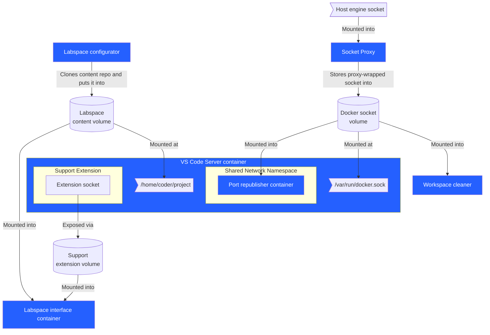

# ❓ What is a Labspace?

A Labspace is a collection of containerized services that provide participants with an isolated Docker workshop environment. It provides a web-based interface to a real Docker environment running in containers, with sophisticated backend services handling isolation and user experience.

And guess what? You're in a Labspace right now! 🎉

Simply put, there's more than just the VS Code Server with a split-screen interface. Inside the environment is a Docker Socket proxy, port republishing, custom VS Code extension, and more. This Labspace will introduce you to each of these elements.

## 🏛️ The Labspace architecture

A Labspace can be broken down into two categories of components:

1. 🧩 **The infrastructure.** This includes the IDE, configurator, port republisher, and other components. These components are maintained by the Docker Labspace team.
2. 📝 **The content.** This includes the actual materials a participant reads (such as this text) and any relevant application code. Content can be written by anyone!

The **content** is typically stored in its own GitHub repository. The content for this Labspace is in the infra repo as a sample of what's possible.

A Compose file is used to connect the _content_ with the _infrastructure_. By using this approach, **a published Compose file can fully encapsulate and configure a Labspace**.

The following Compose snippet shows how the content is merely an environment variable for the _configurator_ service. This service will clone the repo and place it into a volume that is then shared with all the other services:

```yaml
services:
  configurator:
    image: michaelirwin244/labspace-configurator
    volumes:
      - project:/project
    environment:
      PROJECT_CLONE_URL: https://github.com/mikesir87/labspace-about-labspaces

  interface:
    ...

  workspace:
    ...

  host-republisher:
    ...

  workspace-cleaner:
    ...

  socket-proxy:
    ...

volumes:
  socket-proxy:
  content:
  support-vscode-extension:
```

### The Labspace components

Beyond the configurator, there are quite a few other services.

The following architecture diagram captures these components and how they work with each other.



Let's dive into how they are used to help create the Labspace environment.

#### The configurator

The configurator is in charge of bootstrapping the Labspace. It specifically does the following:

1. Clone the content repo and place it into the Labspace content repo.
2. Create a public/private keypair for the VS Code extension
3. Update file permissions and make sure everything is ready to go!

This service is a dependency for most of the other services.

#### Interface

This component presents the split-screen interface that renders the Labspace instructions on the left and presents the VS Code editor on the right.

It also creates and submits "command execution requests" for the VS Code extension, using the private key created during bootstrapping.

#### VS Code Server

This is an extension of the [VS Code Server](https://github.com/coder/code-server) project to provide an IDE in the browser. It is updated in the following ways:

- **Docker CLI tooling** - the Docker CLI and various plugins (Scout, Docker Model Runner, Compose, etc.) are pre-packaged and already in the environment
- **Node development environment** - as of today, the development environment is a Node-based environment. Eventually, we might have other variants for other languages.
- **Labspace extension support** - a custom extension to support the "Run" button from the interface
- **Default environment variables and configuration** - the environment has a few default environment variables to ensure Docker Model Runner works as expected, the IDE doesn't provide unnecessary prompts, and more.

#### Docker Socket Proxy

This component mutates, validates, and filters the requests and responses to the Docker Engine to help the isolated environment work as smoothly as possible.

You'll learn about these configurations in the next step.

#### Port republisher

This component watches and connects containers with host-published ports into the environment, making it "feel" like the environment is running natively on the machine.

#### Workspace cleaner

This component simply ensures all Docker resources are automatically cleaned up when the Labspace is torn down.


## Next steps

In this Labspace, you're going to become more familiar with the environment, its capabilities, and how its structured. 

Let's get going!