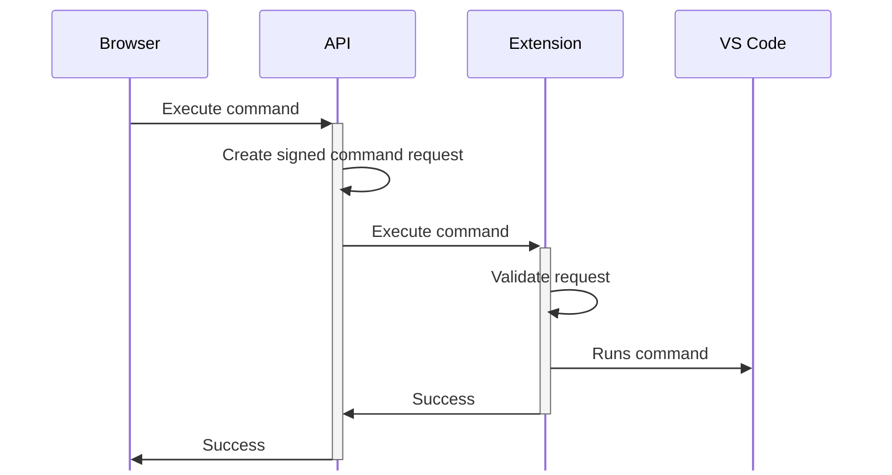
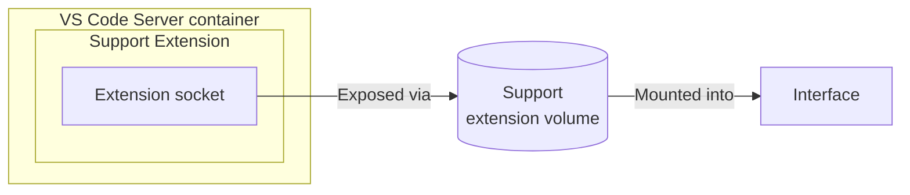

# 🔨 The VS Code Extension

In order to create a seamless experience and allow the "Run" buttons to work in the interface, a custom extension was required.

## ❓ How does it work?

Simply put, when the "Run" button is pressed, the following process occurs:

1. The browser makes an API call to the interface backend
2. The backend determines the command that needs to be executed.
3. A JWT is created to package and sign the command execution request
4. The command is forwarded to the extension using the API exposed via unix socket
5. The extension receives the request and validates the JWT
6. The extension either uses an existing terminal or launches a new terminal and executes the command.



As mentioned above, the communication between the extension and the interface is performed using a Unix socket that is shared between the containers using volumes.




## 🔐 Securing the requests

Recognizing this capability is providing the ability to run arbitrary commands in a terminal, a few security mechanisms were integrated.

### Securing the Unix socket

**Problem:** The Unix socket provides an API to run arbitrary commands. We want the extension to run commands only from the interface.

**Solution:** The Labspace is using signed JWTs to package and sign the command execution requests.

During Labspace startup, a new public/private keypair is created and placed into the extension support volume. The private key is shared _only_ with the interface container, while the VS Code container only has access to the public key. This allows the interface backend to create and sign requests and for the extension to validate those requests.


### Removing RCE opportunities from the API endpoint

**Problem:** The interface API could expose an endpoint that allows the command to be defined in a POST body, that API endpoint would be open to the entire machine. Example:

```sh no-run-button
curl http://localhost:3030/api/command -H "Content-type: application/json" --data '
{
  "command": "docker ps"
}'
```

**Solution:** Recognizing the only commands that should be run are those that are defined in the content files, the endpoint sends a request for the request section and code block index to execute. The backend then extracts the command from the content and uses that.

```sh no-run-button
curl http://localhost:3030/api/sections/section-title/command -H "Content-type: application/json" --data '
{
  "codeBlockIndex": 0
}'
```

## 🔨 Building and auto-installing the extension

The extension's directory contains a `Dockerfile` that is used to build and package the extension as a `.vsix` file, which can be installed during the build of the VS Code server container image.

But since these are separate projects, how are the files shared? Enter additional build contexts.

In the `docker-bake.hcl` file, the `workspace` target specifies an additional build context, referencing the extension build target:

```hcl
target "workspace" {
  ...
  contexts = {
    extension = "target:support-vscode-extension"
  }
}
```

With this, Bake will build the extension and then make it available to the `workspace` build. The workspace can then use it in its Dockerfile:

```dockerfile
RUN --mount=from=extension,target=/extension code-server --install-extension /extension/support-extension.vsix
```

Great! But, what about Compose? Well, Compose has additional build context support too!

```yaml
services:
  vscode-extension:
    build: ./components/support-vscode-extension

  workspace:
    build: 
      context: ./components/workspace
      additional_contexts:
        extension: service:vscode-extension
```

The only caveat here is that Compose is going to build the image and start a container using the image. This is why the image is essentially a no-op container rather than a `FROM scratch` (it needs a default command to run).
